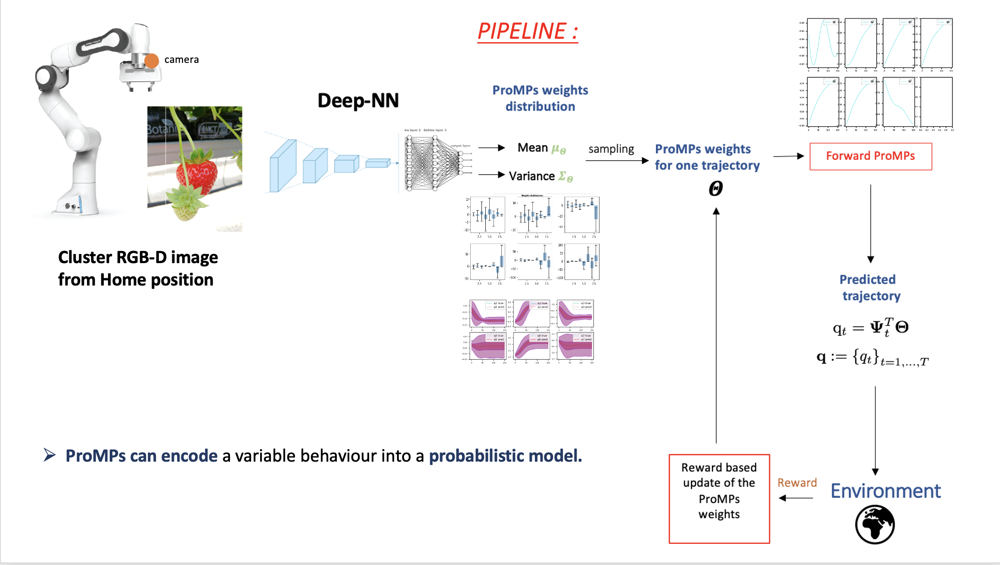

# Deep_ProMPs_learning_for_strawberry_picking

<!-- TABLE OF CONTENTS -->
## Table of Contents

* [About the Project](#about-the-project)
  * [Built With](#built-with)
* [Getting Started](#getting-started)
  * [Prerequisites](#prerequisites)
  * [Set Up](#Set-Up)
* [Usage](#usage)
* [References](#references)
* [Contact](#contact)

## About The Project

The project is about Probabilistic Movement Primitives prediction through Deep models and optimization through Reinforcement Learning. Everything is applied to the Agri-robotics framework, in particular to the problem of strawberry picking.

The particular task considered is the Reach to Pick task so the simple action of approaching a target ripe strawberry with a robotic arm. This task should be performed using as input simply the RGB-D image ot the strawberry cluster from the home position.

The movement is predicted using movement primitives as encoding method so that only a bunch of weights should be predicted by the deep neural network taking as input the image from the home position.

In particular the predicted policy is not deterministic but stochastic since the model is trained on a distribution of trajectories provided as demonstrations.

the global piplein of the project is: 

## Build With

The whole simulation is executed in [Pybullet](https://pybullet.org/wordpress/). And the deep models are trained using [Tensorflow 2.7](https://pypi.org/project/tensorflow/) .

## Getting Started

### Prerequisites

### Setup

## Usage

## References

## Contact

For any issues please contact Alessandra Tafuro at taffi98.at@gmail.com
