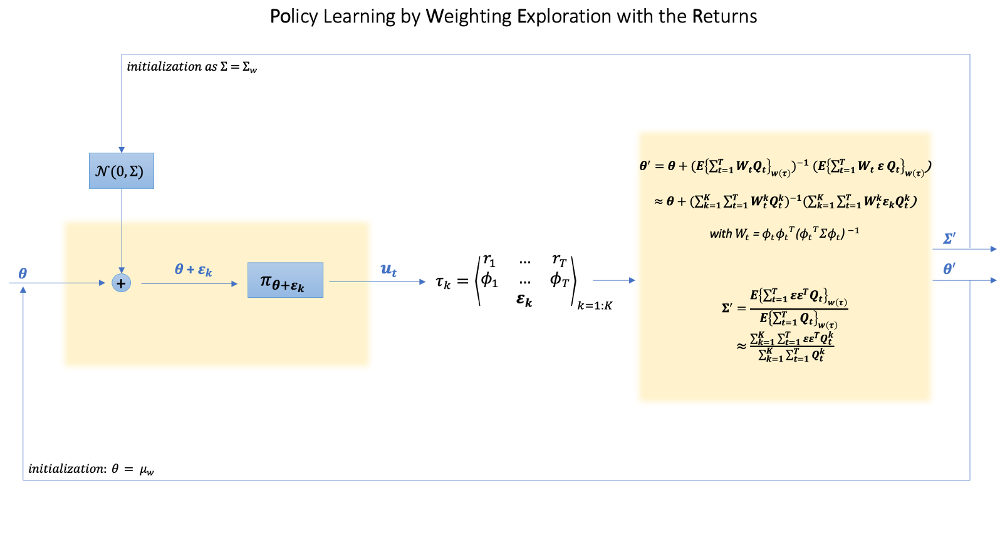
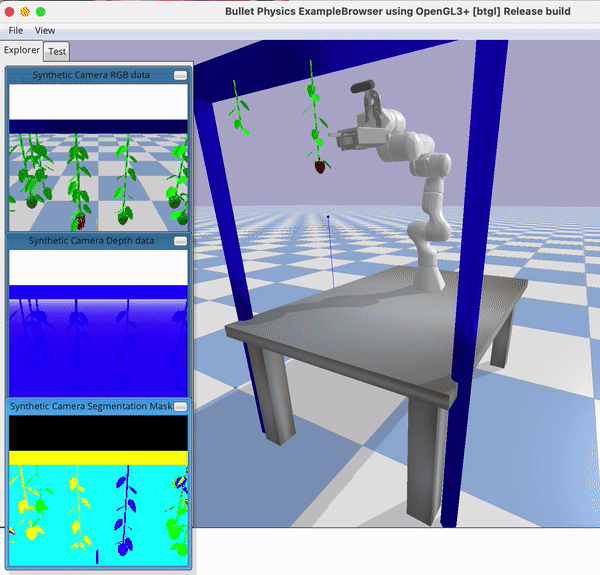
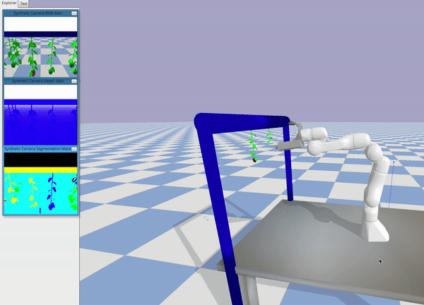

# Deep ProMPs learning for strawberry picking


<!-- TABLE OF CONTENTS -->
## Table of Contents

* [About the Project](#about-the-project)
  * [Built With](#built-with)
* [Getting Started](#getting-started)
  * [Prerequisites](#prerequisites)
  * [Set Up](#Set-Up)
* [Usage](#usage)
  *  [PyBullet simulations collection](#PyBullet-simulations-collections)
  *  [ProMPs training](#ProMPs-training)
  *  [PoWER](#PoWER)
* [References](#references)
* [Contact](#contact)


## About The Project

The project is about Probabilistic Movement Primitives prediction through Deep models and optimization through Reinforcement Learning. Everything is applied to the Agri-robotics framework, in particular to the problem of strawberry picking.

The particular task considered is the Reach to Pick task so the simple action of approaching a target ripe strawberry with a robotic arm. This task should be performed using as input simply the RGB-D image of the strawberry cluster from the home position.

The movement is predicted using movement primitives as encoding method so that only a bunch of weights needs to be predicted by the deep neural network taking as input the image from the home position.

In particular the predicted policy is not deterministic but stochastic since the model is trained on a distribution of trajectories provided as demonstrations.

The global pipline of the project is: 


And the model architecture used to predict Promps weights distribution is:


The variance in the final orientation of the EE is the main type of uncertainty in the demonstrations encoded in the ProMPs weights.

 


## Build With

The whole simulation is executed in [Pybullet](https://pybullet.org/wordpress/). And the deep models are trained using [Tensorflow 2.7](https://pypi.org/project/tensorflow/) .


## Getting Started

### Prerequisites

The first thing to do is to create an environment with the necessary packages (listed in req.txt) using: 
```
conda create -n <environment-name> --file req.txt
```

## Usage

### PyBullet demonstrations collection

This repository contains the code to collect the demonstrations for the reach to pick task. For 60 different random cluster configurations, 10 demonstrations have been taken. Each of them encodes a different orientation of the End Effector at the final point. 

We recommend using [IKFast](http://openrave.org/docs/0.8.2/openravepy/ikfast/), an analytical inverse kinematics solver, instead of PyBullet's damped least squares solver. IKFast bindings are included for Franka Panda robot:

```
cd PyBullet_simulations/panda_gym/resources/pybullet_tools/ikfast/franka_panda; python setup.py
```

The custer configuration is completely randomized but there are three recurrent configurations, namely with no obstacles in front of the target strawberry (Config 0), with an obsatcle on the left (Config 1) and with and obstacle on the right (Config 2) .


To collect the demonstrations for Config 0 run:

```
python PyBullet_simulations/panda_gym/resources/Collect_Demonstrations.py
```

To collect the demonstrations for Config 1 run:

```
python PyBullet_simulations/panda_gym/resources/Collect_Demonstrations_1.py
```

To collect the demonstrations for Config 2 run:

```
python PyBullet_simulations/panda_gym/resources/Collect_Demonstrations_2.py
```

Having a dataset with balanced number of demonstrations for the three configurations helps for a better generalization. For this reason 20 demonstrations for each configurations have been collected for the experiment. (3 * 20 = 60 different cluster configurations)

For each demonstration an RGB-D image from the home position and the 9 joints trajectories are recorded in the ``` Data_collected``` folder. 

An dataset of demonstrations is available at [this link](https://drive.google.com/drive/folders/118D5Strr-DAFOcBNMijPIJiI24i6cgA2?usp=sharing).

### ProMPs training

With the collected dataset it is time to train the deep models to predict the ProMPs weights distributions.

The first thing to do is to fill the ``` ProMP_training/data/color_img```,``` ProMP_training/data/depth```,``` ProMP_training/data/json_files``` folders with the data from the collected demonstrations.

The second thing to do is to create the annotations for the mean and covariance of the ProMPs weights. To do this, for each folder in ``` ProMP_training/single_joint_covariances``` run:

```
python ProMP_training/single_joint_covariances/ProMPs_Reach_to_Pick_X/DEEP MODEL EXPERIMENT/data_preprocessing.py
```

This will create .json files  in the ``` ProMP_training/single_joint_covariances/ProMPs_Reach_to_Pick_X/annotations/``` folder.

Now you are ready to go with the training running:
```
python ProMP_training/single_joint_covariances/ProMPs_Reach_to_Pick_X/DEEP MODEL EXPERIMENT/train_test.py
```

A version of already trained models is available at [this link](https://drive.google.com/drive/folders/14XoIeWI4mnoz4NsnKx7VsvDYEoeF_5MY?usp=sharing)

### PoWER

Ok now your Deep models are able to predict the trajectories distributions. But what's the optimal value of the weights for a certain cluster configuration?
Here the Policy learning by Weighting Exploration with the Returns algorithm has been used to optimize the policy.




An implementation of this algorithm is available in the  ``` PyBullet_simulations/PoWER/PoWER.py``` file.

To start the iterations of the algorithm simply run:
```
python PyBullet_simulations/RL_training.py
```
You can then try the new optimized wieghts inserting them in the ```PyBullet_simulations/test_panda_gym.py```file and running it.

Below an example of trajectory preformed before and after the optimization through PoWER:
#### Before PoWER
 
#### After PoWER



## References
#### IkFast: 
http://openrave.org/docs/0.8.2/openravepy/ikfast/

#### PoWER:
https://link.springer.com/article/10.1007%2Fs10994-010-5223-6

#### ProMPs:
http://eprints.lincoln.ac.uk/id/eprint/25785/1/5177-probabilistic-movement-primitives.pdf

## Contact

For any issues please contact Alessandra Tafuro at taffi98.at@gmail.com
